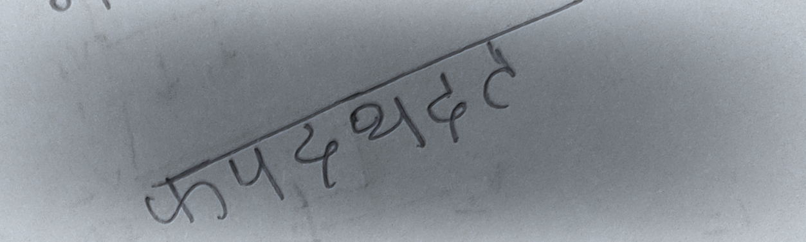
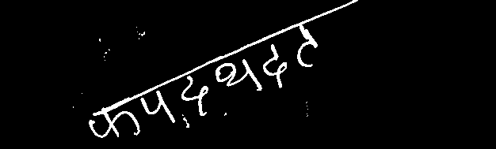
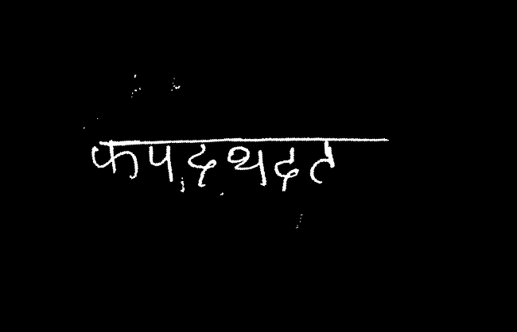
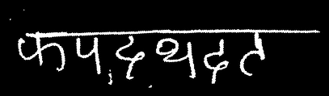
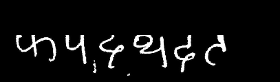

# Handwritten-Hindi-Word-Recognizer

There are three steps in recognition which are pre-processing, feature extraction and classification.
We adopt the divide-and conquer policy wherein a major category is divided into sub-categories thus making the classification process simpler. 
Segmentation is the important step. Segmentation also contains three major steps such as line segmentation, word segmentation and character segmentation. If we fail in doing line segmentation then entire segmentation process goes wrong.

We start with loading the image using load_image function then remove major noise and shadows using adaptive thresholding method on the original image using remove_noise_and_preprocess function. For further cleaning the image, we first resize the image to 50% of it’s original size using makesmall function, then we apply simple thresholding methods like Thresh_binary, thresh_OTSU. We then apply morphological operation Opening so that the image looks better using preprocess function. 

                     original image                                  preprocessed image
                                   

So, one thing I want to mention here that we applied preprocessing two times with different thresholding strategy because we saw for some images adaptive thresholding was giving better results and for some images simple thresholding with OTSU method was giving better results. We then finally took Bitwise AND operation so that we can have combined results from both type of thresholding methods.

Sometimes what happens, we got an image of the word in which the word is not approximately horizontal. In order to deal with and making the whole model invariant to rotation or tiltness of the word, we have applied Houghline transformations using hough_transformation function.

                     preprocessed image                                  rotated image
                                   

This function first detects every possible edge in the image using cannyedge detection method. Once all edges are detetcted, we passed all edges to cv2.houghline method which gives an array of theta and r values of all lines detected, typically these returned array elements are in the polar form, so we need to convert it into cartesian form, and by doing so we captured the co-ordinates of the line which is the largest one, more precisely, we here detected the headerline end co-ordinates. Using these co-ordinates we found the angle to which this header line is rotated with respect to horizontal line. And thus we rotate it in inverse direction so that the header line of the word becomes approximately horizontal. By applying this method, we made our model invariant to the rotation till the 80 degrees of angle.

Now, for applying further subtle analysis, we want the cropped image whose entire region is approximately the word itself. For obtaining that image, we need to first localize the word in the image. 

This was by using word_segementation function. In this function, we need to check where contours are located, but there were the possibilities of multiple contours. So, to deal with we performed dilation operation, so that the characters got thicked and the entire word could come under a single contour.
Then we use boundingRect function of cv2 module to get the co-ordinates ot the bounding box which surrounded the entire word. Using these co-ordinates, we extract the word from the preprocessed image using extract_roi function.
Once we got the segmented word region as a separate image, we need to work on character segmentation which is the most important part of the entire model.

                     rotated image                                  word segmented image
                                   

For this, we used vertical projection method but for applying this method we need to remove header line first. Once the header line is removed, we can easily separate the characters from the word because there was black space present between the characters, which we can use to segment individual characters.

Coming to header line removal part, we used two copies of the segmented word image that we obtained using extract_roi method. By using one of the copied image, we remove all white pixels which were present within 1/3 portion of the image from the top by equating their pixel values to zero. Thus, we removed the header line using this simple strategy. Now, the header line is removed we can apply vertical projection method. We start iterating to each column. The segmented region between two characters would have the entire column pixel density as zero. And therefore, while iterating to each column, we keep a track of the columns whose pixel density is entirely zero. Once, we obtained the list of that columns, we use extract_roi function to extract the characters on the basis of the columns from the other copied image of the segmented word we obtained previously.

                     word segmented image                                  header removed image
                                  
